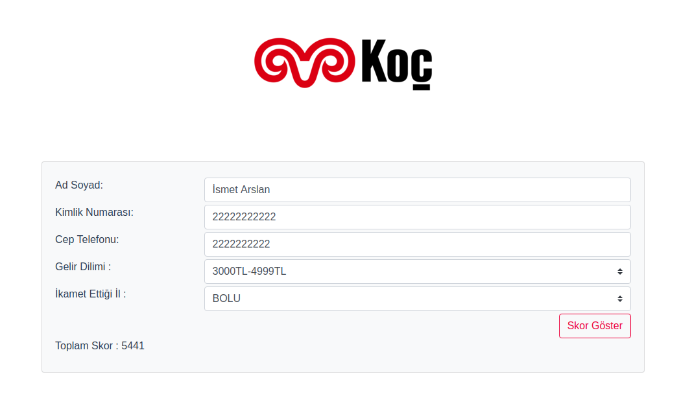

# KocFinanceScoreProject

Koç Finans kurumu için hazırlanan skor hesaplama projesidir.

## Kurulum

Uygulamanın çalışması için bilgisayarınızda aşağıdakilerin kurulu olması gerekli;

- Java 1.8
- Maven 3.x
- VueJS
- npm
- docker
- lombok
- Intellij Idea (Tercihen)

Uygulamayı klonladıktan sonra VueJS tarafının ayağa kalkması için aşağıdaki adımları izleyebilirsiniz;

Terminalden uygulamanın klonlandığı dizin içerisindeki web klasörüne gittikten sonra aşağıdaki komutu çalıştırın;


```bash

 npm run serve

```

Bu komuttan sonra aşağıdaki gibi bir görüntü ile karşılaşmanız gerekmekte. 
**Herhangi bir hata aldığınız durumda package-lock.json dosyasını silip tekrar komutu çalıştırmayı deneyebilirsiniz.


Daha sonra docker dosyasını ayağa kaldırmamız gerekmekte;

<Proje dizini>/src/main/resources/ dizinine geldikten sonra aşağıdaki komutu çalıştırabilirsiniz;

```bash

 sudo docker-compose -f docker-compose.yml up

```

Daha sonrasında kullandığınız IDE üzerinden "KocFinanceDemoApplication" dosyasını run edebilirsiniz.


## Ekran Görüntüleri

uygulamanın ilk açıldığı hali;


Required uyarıları;


Eksik veya hatalı giriş sırasındaki uyarılar;


Skor hesaplama sırasında herhangi bir hata aldığında;


Her şey başarılı gidip skor hesaplandığında;



Skor hesaplandıktan sonra gönderilecek sms tabloya aşağıdaki şekilde kayıt atılır;


## Genel Bilgilendirme 

Kimlik numarasından 1 ile 9 arasında skor üretimi, kimlik numarasının sayılarının toplamından elde edilmiştir.
1 ile 9 arasında bir sayıya ulaşıncaya kadar sürekli toplandı.

0 ile 20000 arasındaki şehir skoru bilgisi random üretilmiştir.


## POST Servis Kullanımı

URL : 127.0.0.1:8081/score/insert-new-person-score/

Örnek input;

```json

{
    "identityNumber": "24365522254",
    "nameAndSurname": "İsmet Arslan",
    "phoneNumber": "5079644444",
    "incomeTranche": "1",
    "residence": "34"
}


```

Örnek Output;

```json

{
    "id": "24365562058",
    "identityNumber": "24365562058",
    "nameAndSurname": "İsmet Arslan",
    "phoneNumber": "5079644796",
    "incomeTranche": "1",
    "residence": "34",
    "score": 19839,
    "status": true,
    "message": "Ok"
}

```


